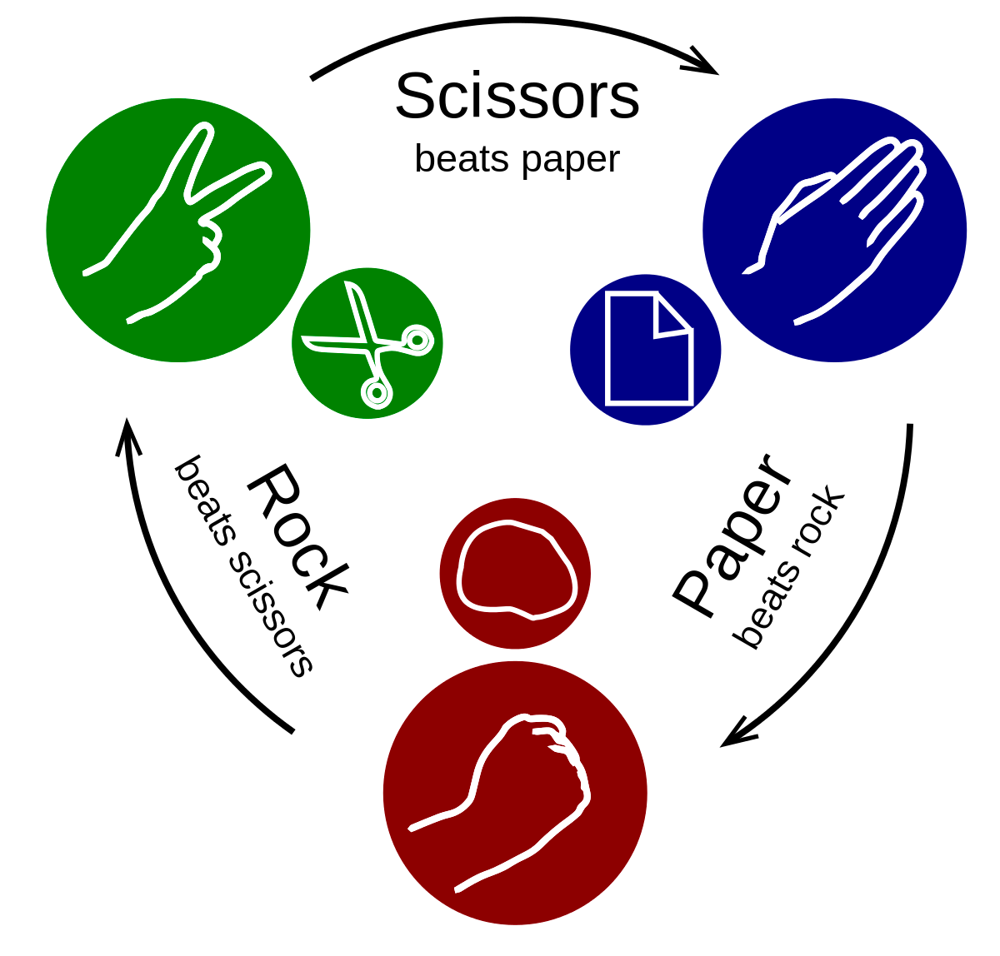

# Rock, Paper, Scissors

### A Java OOP Mini-Project
* <a href="#about-the-game">About the Game</a>
* <a href="#how-to-play">How to Play</a>
* <a href="#technologies-used">Technologies Used</a>
* <a href="#features">Features</a>
* <a href="#diagram">Diagram</a>
* <a href="#reflection">Reflection</a>
* <a href="#credits">Credits</a>
---
## About the Game

Come play a virtual version of rock-paper-scissors!

This fun take on the traditional hand game allows two players to play on the same computer.

Want to play solo? No problem! You can play against a computer too.

## How to Play

#### Installation:

Since this application was built using 100% Java, and Java is a "write once, run anywhere" language, you can play this game if you're using the JVM (Java Virtual Machine). The game is played through the console.

#### Instructions:

Image source: Wikipedia (https://en.wikipedia.org/wiki/Rock_paper_scissors)

* When you first run the game in your console, you will see a welcome message and the main menu.
   * Type 'play' to play. 
   * Type 'scores' to view the current scores. 
   * Type 'quit' to stop playing and end the game.

* If you type 'play', you will automatically be Player 1.
  * You will then need to choose who is Player 2 - either another human, or a computer.
  * All possible players can choose their move from these three answers: 'rock', 'paper', or 'scissors'.
  * Rock wins over Scissors, Paper wins over Rock, Scissors wins over Paper.

* If Player 2 is another human, you can both play from the same computer.
  * Player 1 will enter their answer, and then Player 2 will enter their answer.
  * No peeking! Player 2 should not be looking at Player 1's answer.

* If Player 2 is a computer, Player 1 can go ahead and write their answer.
  * The computer will automatically answer afterward.

* After each round, you can see who won!
* You will be taken back to the main menu automatically, where you can repeat the above steps to play another round.

* If you type 'scores', you can see the current scores of each player, their results at the end of each round, and which moves they made for each round.
* You will be taken back to the main menu automatically.
  * **Hint:** Want to see a snapshot of the scores for each individual round? Open the GameHistory.txt file!

* If you type 'quit', the game ends.
---
## Technologies Used

* **Git**: Used for version control on local computer and pushing changes to remote repository.
* **GitHub**: Used to host the remote repository and hosting the live website.
* **Google Chrome**: The **browser** was used for accessing materials on the internet.
* **Java**: The programming language used for developing this application.
* **IntelliJ IDEA**: This is the IDE (integrated development environment) used to create the application.
  * Build System: IntelliJ 
  * JDK: corretto-17, Amazon Correto version 17.0.6
---
## Features
Project requirements: https://git.generalassemb.ly/java-interapt-3-13-2023/java-oop-mini-project

#### User Stories

- Users should have access to a main menu with options to enter `2 players` or `vs. computer`.
- If the user enters `2 players`, they should be able to play rock–paper–scissors against a human competitor.
- If the user enters `vs. computer`, they should be able to play against the computer.
- When the game is over, the user should see the winner declared.

#### Technical Requirements (MVP)

- [x] Use classes to remove repetitive parts of code, and create an abstract `Player` class to manage the player's state (if they won or lost, how many points they have, what move they made). In addition, interfaces should be used in places where they are necessary.
- [x] Handle invalid user input.
- [x] Handle incorrect capitalization of otherwise valid user input ("rock," "Rock," "RoCk," "ROCK," and more).
- [x] Each class (including a `Player` class) should have methods associated with it and be instantiated as an object (as opposed to a singleton or an interface).
- [x] Use `public`, `private`, and `static` variables, methods, and members within each class appropriately.
- [x] Incorporate exception handling to make sure your game crashes gracefully if it receives bad input.
- [x] Get standard input with Java using a `Scanner`, or use `Processing` to get mouse, keyboard, or other input.
- [x] Use arrays or array lists to store game history (if applicable).

#### Bonus Ideas Completed

- [x] Use an Agile project management framework for your game.
  - I used GitHub's built-in kanban boards for my project tracker: https://github.com/users/knnguyen2410/projects/1

- [x] If the user enters `history`, the program should display previous game history (winner's name, game date, and more).
  - I approached this bonus idea from two angles. I wanted to enable the user two views of the game's history: a snapshot of the current game, and a snapshot past rounds.
    - If the user enters 'history', they can see the information about the current game's progress.
    - If the user opens the GameHistory.txt file, they can see that all rounds' information is stored there and designated with a timestamp.
  - The length of the results and moves trackers indicate how many rounds have been played.

#### Bonus Ideas Remaining (To Do)

- Write automated JUnit tests for your application.
- Use Java packages to modularize code. Place any helper tools in these packages — they could be related input, networking, or graphics.
- Use Maven to install external dependencies your game might require.
- Use [generics](https://docs.oracle.com/javase/tutorial/extra/generics/index.html) on collections such as arrays and array lists to store different data composed of different types.
- Use multithreading to handle concurrent requests (like in multiplayer games).
- Incorporate video, text, data, networking, and sound into your game via `Processing`.
---
## Diagram

Here is my Java Classes Diagram, which provides a high-level overview of the structure of my code.

---
## Reflection

**My biggest takeaway**: I feel that by the end of this product, I have a greater appreciation for the OOP principles of abstraction and polymorphism.

**What I would do differently**: I would spend much more time fleshing out the structure of my program. I now know that when it comes to object-oriented programming, being able to understand where your code should go and where your methods are coming from is crucial. I believe that spending more time understanding the application at a high-level will make a huge difference in saving time, and make refactoring code much smoother.

---
## Credits

* Documentation referenced:
  - [Java BufferedWriter Class](https://www.javatpoint.com/java-bufferedwriter-class)
  - [Java Scanner](https://www.javatpoint.com/Scanner-class)
  - [Class Random](https://docs.oracle.com/javase/8/docs/api/java/util/Random.html)
  - [Class DateTimeFormatter](https://docs.oracle.com/javase/8/docs/api/java/time/format/DateTimeFormatter.html)

Many thanks to **Kevin Barrios**, **Jay Padilla**, and **Obinna Umerah** for their guidance and support throughout this application's creation. I feel so fortunate to be learning alongside such talented developers. Please see their GitHubs, linked below:
* Kevin Barrios: https://github.com/dayjyun
* Jay Padilla: https://github.com/Jaypad07
* Obinna Umerah: https://github.com/ObinnaUmerah

And finally, I have immense gratitude for **Suresh Sigera**, who has taught me everything I know about Java.
